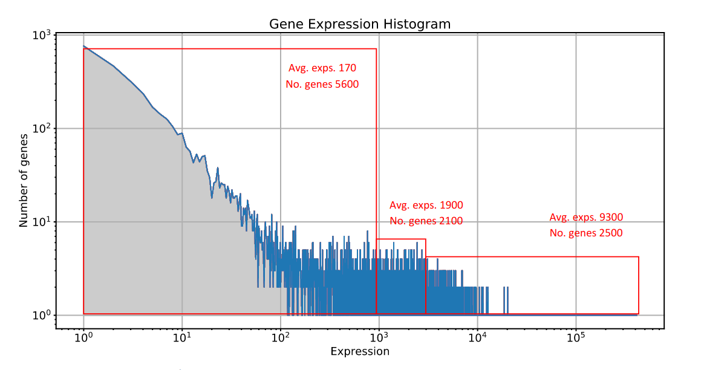
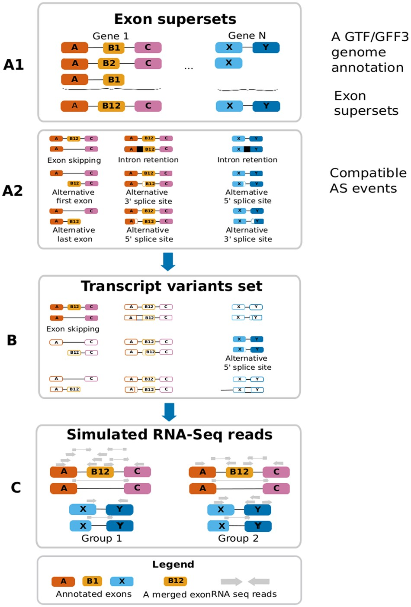

# Detailed Project Proposal

2022-03-05, Zhejian YU, Yaqi SU, Ruihong YUAN

## Introduction

Alternative splicing (AS) is a molecular mechanism that modifies pre-mRNA constructs before translation. This process can produce a diversity of mRNAs from a single gene by arranging coding sequences (exons) from recently spliced RNA transcripts into different combinations. The mechanisms of AS help to explain how one gene can be encoded into numerous proteins with various functions. This complexity helps drive the cellular differentiation and diversity observed throughout biology.

RNA-Seq is commonly used for AS identification and numerous tools are available for this kind of analysis. To objectively assess their sensitivity and specificity together with scalability, gold standard datasets are required. Since the true number and types of AS events (such as exon skipping, intron retention, etc.) in an experimental dataset is not known, suitable datasets need to be simulated. Moreover, Third-Generation Sequencing (TGS), which was developed in recent years, allows sequencing of single transcripts without splitting into short reads. With this method, the transcribed exons can be better preserved, allowing us to perform AS analysis more accurately.

## Review of Existing Algorithms and Projects

### BEERS

BEERS (Benchmarker for Evaluating the Effectiveness of RNA-Seq Software) [^Grant2011] is an NGS RNA-Seq AS generator with built-in LLRG. It can simulate DGE using one empirical dataset from the mouse. It can simulate alternative splicing by randomly removing exons from transcripts.

### RNASeqEval

[RNASeqEval](https://github.com/kkrizanovic/RNAseqEval) [^Krešimir2018] is a general-purpose RNA-Seq AS Generator. It can simulate alternative splicing by randomly removing exons from transcripts. It can also simulate DGE, but in an interesting way introduced below.

From its article, this simulator simulates data in the following steps:

> 1. Analyze real datasets to determine error profiles.
> 2. Filter annotations (keep only primary assembly information) and unify chromosome names.
> 3. Separate annotations for genes with one isoform and genes with alternative splicing, keeping up to 3 isoforms randomly for each gene with alternative splicing.
> 4. Generate a transcriptome from processed annotations and a reference genome.
> 5. Analyze gene expression data and determine gene coverage histogram (see figure).
> 6. Approximate gene coverage histogram with 3 points to determine coverage and number of genes in the simulated dataset. Scale coverages are proportionally down to make a smaller dataset, more suitable for testing.
> 7. Extract 6 subsets of sequences from generated transcriptome, 3 for genes with single splicing and 3 for genes with alternative splicing. Each set contains a number of transcripts corresponding to the number of genes from a previous step.
> 8. Using PBSIM, simulate reads on each generated subset of the transcriptome, using coverages determined in step 6 and error profiles determined in step 1.
> 9. Combine generated reads into a single generated dataset.

The figure below shows how RNASeqEval generates DGE. From its `Readme`, it says:

> Gene expression histogram was approximated with three points (red squares in the figure), each point was described by a total number of genes and average coverage of those genes.

A table of these groups is as follows:

> | Group | Total no. genes | Coverage | Genes without alternative splicing | Genes with alternative splicing | Transcripts with alternative splicing | Coverage for AS transcripts |
> | ----- | --------------- | -------- | ---------------------------------- | ------------------------------- | ------------------------------------- | --------------------------- |
> | 1     | 5000            | 5        | 4500                               | 500                             | 1500                                  | 2                           |
> | 2     | 2000            | 50       | 1750                               | 250                             | 750                                   | 15                          |
> | 3     | 2000            | 100      | 1750                               | 250                             | 750                                   | 30                          |

The data is said to be from _D. Melanogaster_ at <http://bowtie-bio.sourceforge.net/recount/>.

The main ideology of yasim is from this simulator.

### Polyester

[Polyester](https://bioconductor.org/packages/release/bioc/html/polyester.html) [^Frazee2005] is an RNA-Seq read generator and DGE simulator. It is designed to simulate isoform-level DGE from a series of technical-replicates RNA-Seq experiments.

From statistics on DGE patterns provided by [^Anders2010] and [^Robinson2010] and parameter estimation from Genetic European Variation in health and Disease (GEUVADIS) [^Lappalainen2013], [^Peter2013] dataset, the author stated that the number of reads to simulate from each transcript is drawn from the negative binomial distribution, across biological replicates [^Anders2010], [^Robinson2010].

Define $Y_{ijk}$ as the number of reads simulated from replicate $i$, experimental condition $j$ and transcript $k$ and dispersion parameter $r$. We may have:

$$
Y_{ijk} \sim NB(mean = \mu_{jk}, size = r_{jk})
$$

Since the Poisson distribution is suitable for capturing read count variability across technical replicates [^Robinson2010], users can create experiments with simulated technical replicates only by making all $r_{jk}$ very large.

The statistics on Bioconductor can be seen [here](http://bioconductor.org/packages/stats/bioc/polyester/).

### ASimulatoR

[ASimulatoR](https://github.com/biomedbigdata/ASimulatoR) [^Quirin2021] is an NGS RNA-Seq AS Generator, with builtin LLRG provided by Polyester.

Whether to introduce a specific type of AS event on a gene is based on some unknown distribution (with mean and SE, but without a name). Its workflow is displayed as follows:

## Proposed Workflows

The simulation process mainly consists of the following steps:

- Input: reference transcriptome (Human or _C. Elegans_, given by a GTF file).
- Simulate AS events based on a statistical model given by mining raw data and works of literature.
- Output AS events as ground truth GTF, and transcribe GTF into ground truth cDNA.
- Use Low-Level Read-Generators (LLRGs) like [pbsim2](https://github.com/yukiteruono/pbsim2) or [dwgsim](https://github.com/nh13/dwgsim) to generate raw reads forNext- or Third-Generation Sequencing.
- Align to reference genome using a spliced aligner and call alternative splicing events using software like [Stringtie](https://github.com/gpertea/stringtie) or [Freedie](http://github.com/vpc-ccg/freddie).
- Compare the results with ground truth with [gffcompare](https://github.com/gpertea/gffcompare).

## What Our New Simulator Will Bring About

- Enable the simulation of AS events in TGS data.
- The new simulator will be compatible with upstream third-party LLRGs. You may add your favorite LLRG like [ART](https://www.ncbi.nlm.nih.gov/pmc/articles/PMC3278762/) for Rosche 454 machines.
- The new simulator will be more portable. It may be installed with any computer that has a Python interpreter, with minimal dependence on other Python packages.

## Reference

[^Frazee2005]: Frazee, A. C., Jaffe, A. E., Langmead, B., & Leek, J. T. (2015). Polyester: simulating RNA-seq datasets with differential transcript expression. Bioinformatics (Oxford, England), 31(17), 2778–2784. <https://doi.org/10.1093/bioinformatics/btv272>

[^Anders2010]: Anders, S., & Huber, W. (2010). Differential expression analysis for sequence count data. Genome biology, 11(10), R106. <https://doi.org/10.1186/gb-2010-11-10-r106>

[^Robinson2010]: Robinson, M. D., McCarthy, D. J., & Smyth, G. K. (2010). edgeR: a Bioconductor package for differential expression analysis of digital gene expression data. Bioinformatics (Oxford, England), 26(1), 139–140. <https://doi.org/10.1093/bioinformatics/btp616>

[^Lappalainen2013]: Lappalainen, T., Sammeth, M., Friedländer, M. R., 't Hoen, P. A., Monlong, J., Rivas, M. A., Gonzàlez-Porta, M., Kurbatova, N., Griebel, T., Ferreira, P. G., Barann, M., Wieland, T., Greger, L., van Iterson, M., Almlöf, J., Ribeca, P., Pulyakhina, I., Esser, D., Giger, T., Tikhonov, A., … Dermitzakis, E. T. (2013). Transcriptome and genome sequencing uncovers functional variation in humans. Nature, 501(7468), 506–511. <https://doi.org/10.1038/nature12531>

[^Peter2013]: Peter A. C. 't Hoen, P. A., Friedländer, M. R., Almlöf, J., Sammeth, M., Pulyakhina, I., Anvar, S. Y., Laros, J. F., Buermans, H. P., Karlberg, O., Brännvall, M., GEUVADIS Consortium, den Dunnen, J. T., van Ommen, G. J., Gut, I. G., Guigó, R., Estivill, X., Syvänen, A. C., Dermitzakis, E. T., & Lappalainen, T. (2013). Reproducibility of high-throughput mRNA and small RNA sequencing across laboratories. Nature biotechnology, 31(11), 1015–1022. <https://doi.org/10.1038/nbt.2702>

[^Krešimir2018]: Krešimir Križanović, Amina Echchiki, Julien Roux, Mile Šikić, Evaluation of tools for long read RNA-seq splice-aware alignment, Bioinformatics, Volume 34, Issue 5, 01 March 2018, Pages 748–754, <https://doi.org/10.1093/bioinformatics/btx668>

[^Quirin2021]: Quirin Manz, Olga Tsoy, Amit Fenn, Jan Baumbach, Uwe Völker, Markus List, Tim Kacprowski, ASimulatoR: splice-aware RNA-Seq data simulation, Bioinformatics, Volume 37, Issue 18, 15 September 2021, Pages 3008–3010, <https://doi.org/10.1093/bioinformatics/btab142>

[^Grant2011]: Grant, G. R., Farkas, M. H., Pizarro, A. D., Lahens, N. F., Schug, J., Brunk, B. P., Stoeckert, C. J., Hogenesch, J. B., & Pierce, E. A. (2011). Comparative analysis of RNA-Seq alignment algorithms and the RNA-Seq unified mapper (RUM). Bioinformatics (Oxford, England), 27(18), 2518–2528. <https://doi.org/10.1093/bioinformatics/btr427>
